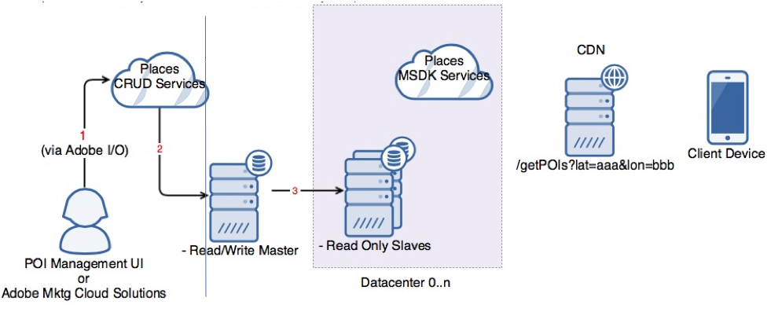

# Overview

Places allows your customers to hydrate the Adobe Cloud Platform and Adobe Experience Cloud solutions with location data, delivering the right experience to the right person at the right time and the right place.

Places comprises the following components:

* The Places UI, which allows you to create points of interest and libraries.  For more information about getting started in the UI, see [Getting Started](https://launch.gitbook.io/places-services-by-adobe-documentation/getting-started).
* The Places Services comprises the REST APIs. For more information about the REST APIs, see [Places REST API Guide](https://launch.gitbook.io/places-developer-by-adobe-documentation/).
* The Places SDK comprises the Places Extension. For more information about the Places Extension, see [Places Extension](https://launch.gitbook.io/launch-adobe-mobile-sdk-beta/v/places/extension-reference/places-extension).
* Places rules, which takes the appropriate actions from the location data.

The goal of Places is to fuse the physical and digital worlds by doing the following:

* Manage Geofences
* Measure location of users even when app is in the background
* Use data in real-time when it matters 

For example, you can send a personalized notification when user enters one of your stores, send link to a satisfaction survey _x_ hours after this user visited one of your stores in San Francisco, and so on.

## Key Features

* Geospatial POI query

  Services to provide POI \(Points of Interest\) in an area \(used by Mobile SDK\)

* Configuration of Places Extension

  Services and UI to control Places settings such as selection of Library for use by a specific App

* POI Database Management

  Services and UI to add/remove/display POIs within a Library

* Rules engine support

  Services and UI to support Places/POI data while creating Mobile SDK rules

* SDK: Utilize Geospatial POI query

  Provide parity with v4 location capabilities, but with just local POIs being queried from the geospatial query API based on grid location of the device

* SDK: Location monitoring

  Monitoring user lat and long from OS

## Benefits

Here are the key benefits to using Places:

* Deliver the right message or experience to users in real time at the instant it is relevant to them and where they are.
* Target messages and experiences to their users based on their historical interactions with places 
* Gain deeper insights into their users by analyzing their physical behavior
* Attribute successful conversions of campaigns with a CTA to visit a physical location

## Terminology

Here are some common terms that are used in the Places documentation:

* A **point of interest \(POI\)** is a location or a point on a map that is of interest to you. 
* A **library** is a collection of POIs.  For example, when you search for _all Thai restaurants near me_, each displayed location is a POI.
* **Places extensions**, in Adobe Launch are used to set configurations for the Places database extension and the monitoring extension for either web or mobile. 
* **Places rules**, which are Launch rules that let you take the appropriate actions from the location data. For more about rules in Launch, see [Rules](https://docs.adobelaunch.com/managing-resources/rules).  
* An **organization** is the entity that enables an administrator to configure groups and users, and to control single sign-on in the Experience Cloud.  The organization functions like a log-in company that spans all the Experience Cloud products and solutions. Most often, an organization is your company name. However, a company can have many organizations.
* The **orgID** is the ID given to your organization.  For more information, see [Finding your orgID](https://forums.adobe.com/thread/2339895).
* The **Experience Cloud ID** service provides a universal, persistent ID that identifies your visitors across all the solutions in the Experience Cloud.  For more information, see [Overview](https://marketing.adobe.com/resources/help/en_US/mcvid/).

## Places Architecture

The following graphic provides a high-level view of the Places architecture:

test

