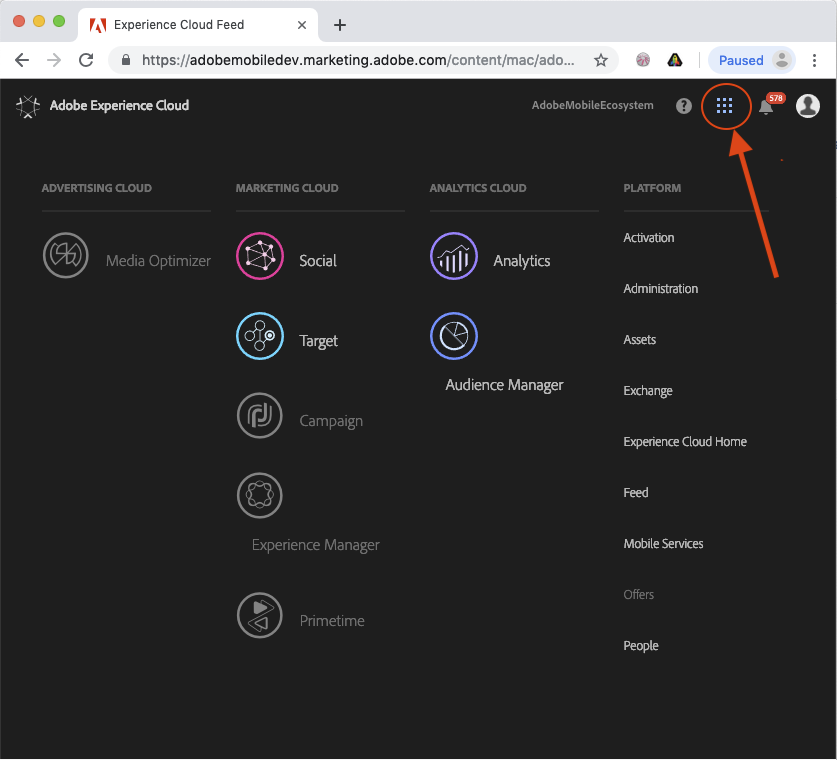
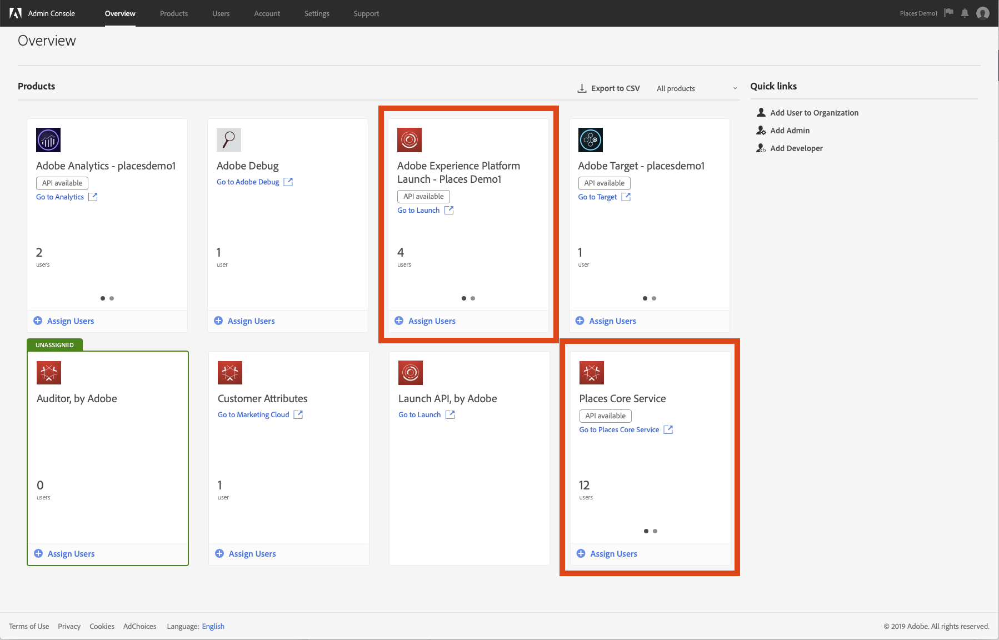

# Adding a user to Launch and Places

To allow users to access places.adobe.com, they need to be added to Places Core Service in the Admin Console as a user. To allow users to have access to Launch, configure mobile properties, and use Places with the Adobe Experience Platform SDK, they need to be added to Adobe Experience Platform Launch in the Admin Console and be given the following permissions for Launch:

* All Property Rights:
  * Develop
  * Approve
  * Publish
  * Manage Extensions
  * Manage Environments
* Manage Properties permission under Company Rights 

If this is the first time you are adding a user, complete the following steps to add users to Launch and Places. If you have added users before, multiple profiles might be displayed, so ensure that you select the correct profile.

**Important**: Only org administrators can access the Admin Console and add the users.

## 1. Verify that Places and Launch are provisioned

To verify that Places and Launch are provisioned:

1. Log in to your Experience Cloud organization.
2. In the top-right side, click the Experience Cloud shell switcher.
   1. 
3. Under **Platform**, click **Administration**.

   If you do not see **Administration** in the list, you are not an admin, and you must contact your org admin to complete this procedure.

4. In the Experience Cloud Administration page, on the **Admin Console** card, click **Take me there**.
5. In the Admin Console, if you have access to several organizations, verify that the correct organization is selected in the top right side of the page.  This is the organization to which you will add your users. If the correct org has not been selected, click on the org, and select the correct org from the drop-down list.  **Important**: If you do not have access to an organization, it means that you do not have admin access to that organization.
6. Verify that the cards for **Adobe Experience Platform Launch** and **Places Core Services** are displayed.

     
  
   If they are displayed, Places and Launch have been provisioned for your organization. If they are not displayed, they have not been provisioned for your organization.   
   **Important**: During the Beta period, after you complete the [Beta survey](https://forms.office.com/Pages/ResponsePage.aspx?id=Wht7-jR7h0OUrtLBeN7O4fkr821yYptFo-ghlnlXCyhUM0dQVkJCSzVDMFNGWEFXWUUwNEJWSjhSRS4u), the request is made to the Provisioning team.

## 2. Set up the profile and add the permissions

To set up the profile and add the permissions:

1. Set up a Launch profile, which allows the users who were added to the profile, to use Launch and its mobile properties with the Adobe Experience Platform SDK.

   a. In the menu bar, click **Product**.

   b. In the left pane, in the list of products, click **Adobe Experience Platform Launch**.

   c. The Launch profile\(s\) will appear on the right.

       Launch has a default profile called, _Launch - \(org name\)_. If you previously added users to Launch before, you might see multiple profiles listed.

2. Select the correct profile:

   a. Click on the name of the default profile.

   b. Click the **Permissions** tab.

   c. Click **Edit** next to **Property Rights**.

   d. In the left pane, click **+ Add all**.  
       This step moves all the available permissions to the included permissions list.

   e. Click **Company Rights**.

   f. In the left pane, click **+ Manage Properties**.

   g. Click **Save**.

**Important**: For Places, there is a default profile, but you do not have to add any permissions to it.

You have successfully added the required permissions to the Launch profile.

## 3. Add a user or a developer to your Launch and Places profiles

You can add a user and/or a developer to your Launch and Places profiles.

### Add a user

To add a user to your Launch and Places profiles:

1. Add a user to the Launch profile.

   a. In the menu bar, click **Overview**.

   b. On the **Adobe Experience Platform Launch** card, verify the following:

   * Two dots are displayed at the bottom of the card.
   * The dot on the left is black.

     If the dot on the right side is black, you can only add developers. To add a user, click the dot on the left.

   c. Click **+ Add Users**.

   d. Enter the user’s Adobe ID.

   e. Complete one of the following steps:

   * If you are adding a new user, click **New user**, and enter the user’s first and last name.
   * If you are adding an existing user, click the user’s name that is displayed.

   f. In the **Please select a profile for this product** drop-down list, select the profile that you edited earlier.

   g. Click **Save**.

2. Add a user to **Places Core Services**.

   **Tip**: Currently, all Places users have the same permissions, so you do not need to edit the permissions.

   a. On the **Places Core Services** card, verify the following:

   * Two dots are displayed at the bottom of the card.
   * The dot on the left is black.

   b. Click **+ Assign Users**.

   c. Enter the user’s Adobe ID.

   d. Complete one of the following steps:

   * If you are adding a new user, click **New user,** and enter the user’s first and last name.
   * If you are adding an existing user, click the user’s name that is displayed.

   e. In the **Please select a profile for this product** drop-down list, select the Places profile.

   f. Click **Save**.

### Add a developer

To add a developer:

1. For users who also need access to the Places REST API, you need to add them as a Developer to Places Core Services.

   a. On the **Places Core Services** card, verify the following:

   * Two dots are displayed at the bottom of the card.
   * Click the dot on the right so **Assign Developers** appears at the bottom of the card.

   b. Click **+ Assign Developers**.

   c. Enter the user’s Adobe ID.

   d. Complete one of the following steps:

   * If you are adding a new user, click **New user**, and enter the user’s first and last name.
   * If you are adding an existing user, click the user’s name that is displayed.

   e. In the **Please select a profile for this product** drop-down list, select the Places profile.

   f. Click **Save**.

Users receive an email notifying them that they have access to Launch and can now log into the Launch \([launch.adobe.com](https://launch.adobe.com)\) or the Places \([places.adobe.com](https://places.adobe.com)\) UIs for this organization. If you completed step 4, the user can also log in to the Adobe I/O console \([console.adobe.io](https://console.adobe.io)\) to create a Places Integration and use the Places REST API.

