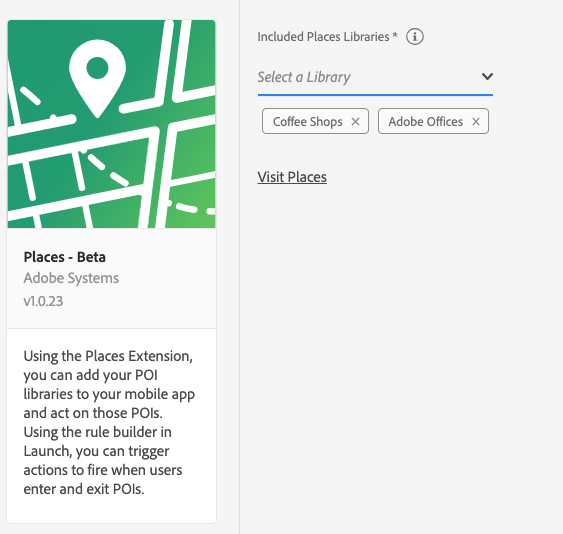

# Places extension

The Places extension allows you to act based on the location of your users. This extension is the interface to the Places Query Service APIs. By listening for events that contain GPS coordinates and geofence region events, this extension dispatches new events that are processed by the Rules Engine. The Places extension also retrieves and delivers a list of the nearest POI for the app data that retrieves from the APIs. The regions returned by the APIs are stored in cache and persistence, which allows limited offline processing.

## Configure the Places extension in Launch

1. In Launch, click the **Extensions** tab.
2. On the **Catalog** tab, locate the **Adobe Places** extension, and click **Install**.
3. Select the Places libraries you want to use in this property.
4. Click **Save**. When you click **Save**, the Experience Platform SDK searches the Places Service for POIs in the libraries that you selected. The POI data is not included in the download of the library when you build the app, but a location-based subset of POIs is downloaded to the end user's device at runtime and is based on the user's GPS coordinates.
5. Complete the publishing process to update the SDK configuration.

   For more information about publishing, see [Publishing](https://docs.adobelaunch.com/launch-reference/publishing).

### Configure the Places extension



## Add the Places extension to your app



**Java**

1. Add the Places extension to your project using your app's gradle file.

   ```java
   implementation 'com.adobe.marketing.mobile:places:1.+'
   implementation 'com.adobe.marketing.mobile:sdk-core:1.+'
   ```

2. Import the Places extensions in your application's main activity.

```java
import com.adobe.marketing.mobile.Places;
```



1. Add the Places and [Mobile Core](https://aep-sdks.gitbook.io/docs/using-mobile-extensions/mobile-core) libraries to your project. You will need to add the following pods to your `Podfile`:

   ```text
   pod 'ACPPlaces', '~> 1.0'
   pod 'ACPCore', '~> 2.0'    # minimum Core version for Places is 2.0.3
   ```

   Alternatively, if you are not using Cocoapods, you can manually include the Mobile Core and Places libraries from our [releases page](https://github.com/Adobe-Marketing-Cloud/acp-sdks/releases/) on Github.

2. Update your Cocoapods:

   ```text
   pod update
   ```

3. Open Xcode, and in your AppDelegate class, import the Core and Places headers:

**Objective-C**

```text
   #import "ACPCore.h"
   #import "ACPPlaces.h"
```

**Swift**

```swift
   import ACPCore
   import ACPPlaces
```



### Register Adobe Places with Mobile Core



In your App's `OnCreate` method register the Places extensions:

```java
public class PlacesTestApp extends Application {

    @Override
    public void onCreate() {
        super.onCreate();
        MobileCore.setApplication(this);

        try {
            Places.registerExtension();
            MobileCore.start(null);
        } catch (Exception e) {
            Log.e("PlacesTestApp", e.getMessage());
        }
    }
}
```



In your App's `application:didFinishLaunchingWithOptions:` method, register the Places extension with your other SDK registration calls:

#### Objective-C

```objectivec
- (BOOL)application:(UIApplication *)application didFinishLaunchingWithOptions:(NSDictionary *)launchOptions {
    // make other sdk registration calls
    [ACPPlaces registerExtension];    
    return YES;
}
```

#### Swift

```swift
func application(_ application: UIApplication, didFinishLaunchingWithOptions launchOptions: [UIApplication.LaunchOptionsKey: Any]?) -> Bool {
    // make other sdk registration calls
    ACPPlaces.registerExtension();
    return true;
}
```



## Configuration keys

To update the SDK configuration programmatically at runtime, use the following information to change your Adobe Places configuration values. For more information, see [Configuration API Reference](https://aep-sdks.gitbook.io/docs/using-mobile-extensions/mobile-core/configuration/configuration-api-reference).

| Key | Required | Description |
| :--- | :--- | :--- |
| `places.libraries` | Yes | The places libraries for the mobile app. It specifies the library ID and the name of the library that the mobile app supports. |
| `places.endpoint` | Yes | The default Places Query Service endpoint, which is used to get information about libraries and POIs. |

