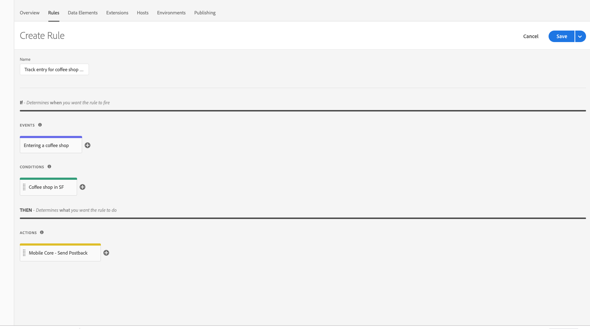

# Creating a rule for your Places property

The Places SDK keeps track of the current location, monitors the configured POIs around the current location, and tracks the entry and exit events for these POIs.

## Rules

You can configure a rule, which is composed of an event, a condition, and an action. Each rule is composed of the following: 

* One or more events
* \(Optional\) conditions
* One or more actions

### Places events

Places offers the following events on which you can run a rule:

* **Enter POI**, which is triggered by the Places SDK when your customer enters the POI that you configured.
* **Exit POI**, which is triggered by the Places SDK when your customer exits the POI that you configured.

### Places conditions

Conditions define the criteria that the data associated with the event, or the shared state of an extension at that instance, must meet for the action to be taken. For example, you can set a condition to trigger an action on an entry to a coffee shop only in the city of San Francisco.

The Places SDK maintains the following states:

* Current POI, which refers to the POI in which your customer is currently located.
* Last exited POI, which refers to the most recent POI that your customer exited.
* Last entered POI, which refers to the most recent POI that your customer entered.

Each POI contains the following data elements:

* ID 
* Name:
* Latitude/longitude
* Radius
* Metadata such as city, country, state, category

### Actions

Actions define what the app will do in response to the condition for the rule is met for the fired event. For example, when your customer enters your POI, you can configure a welcome message to display on their mobile device.

## Create a rule: an example


This example assumes that you have created a POI library of all coffee shops in the United States. For more information about creating POIs and libraries, see  [Create a POI](https://placesdocs.com/places-services-by-adobe-documentation/places-database-management-1/managing-pois-in-the-places-ui#create-a-poi) and [Create a Library](https://placesdocs.com/places-services-by-adobe-documentation/places-database-management-1/manage-libraries#create-a-library).


The following procedure is an example of how to create a rule that sends a post back to Slack when you enter a coffee shop in San Francisco.

The event, condition, and action are defined in the following ways:

* **Event**: Places entry event.
* **Condition**: City for the **Current POI** is San Francisco
* **Action**: Send a postback to Slack the name of the coffee shop that your customer entered.

### Prerequisite

Before you create a rule, you must create a data element in Adobe Experience Platform Launch. Data elements automatically populate the necessary information about your POI in the postback message.

To create a data element in Experience Platform Launch:

1. Click the **Data Elements** tab.
2. Click **Add Data Element**.
3. Type a name, for example, **Current coffee shop name**.
4. In the **Extension** drop-down list, select **Places – Beta**.
5. In **Data Element**, select **City**.
6. In the right pane, select **Current POI**.
7. Click **Save**.

### Create a rule in Experience Platform Launch for Places

1. In Experience Platform Launch, click the **Rules** tab.
2. Click **Add Rule**.
3. Type a name for the rule, for example, **Track entry for coffee shop in SF**.

### Create an event

1. In the Events section, click **+ Add**. Events determine when you want the rule to fire.
2. In the **Extension** drop-down list, select **Places – Beta**.
3. In the **Event Type** drop-down list, select **Enter POI**.
4. In **Name**, enter a name for the event, for example, **Entering a coffee shop**.
5. Click **Keep Changes**.

### Create a condition

1.  In the Conditions section, click **+Add**. Conditions determine what criteria has to be met for the action to be taken.
2. In **Logic Type**, select Regular, which allows actions to execute if the condition is met.
3. In the **Extension** drop-down list, select **Places – Beta**.
4. In **Condition Type**, select **City**.
5. Type a condition name, for example, **Coffee shop in SF**.
6. In the right pane, click **Current POI**, and in the drop-down list, select **San Francisco** as one of your cities.
7. Click **Keep Changes**.

### Create an action

1. In the Actions section, click + Add.
2. In the Extension drop-down list, leave the default Mobile Core option selected.
3. Select an action type, for example, Send Postback.
4. In URL, type the postback URL for Slack, for example, `https://hooks.slack.com/services/`.
5. To send a post body, select Add Post Body.
6. In Post Body, add the post body, for example: `{  "text": "A customer has entered"  }`
7. Type a content type for example **application/json**.
8. Select a timeout value, for example, **5**.
9. Click Keep Changes.

### Publish the rule

1. To activate the rule, you must publish it. For more information about publishing your rule in Experience Platform Launch, see [Publishing](https://docs.adobelaunch.com/launch-reference/publishing).

