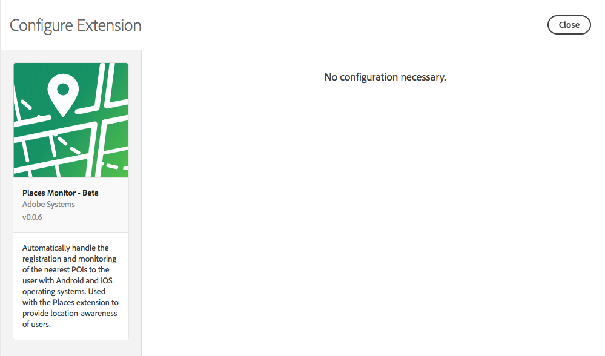

# Using the Places Monitor extension

## Install the Places Monitor extension in Experience Platform Launch <a id="configure-places-monitoring-extension-in-launch"></a>

1. In Experience Platform Launch, click the **Extensions** tab.
2. On the **Catalog** tab, locate the **Places Monitor** extension, and click **Install**.
3. Click **Save**.
4. Follow the publishing process to update the SDK configuration.

### **Configure the Places Monitor extension** <a id="configure-places-extension"></a>

There are no configuration tasks for the Places Monitor extension.



## Add the Places Monitor extension to your app <a id="add-places-monitor-extension-to-your-app"></a>



#### Java

1. Add the Places Monitor extension and the Places extension to your project using your app's gradle file.
2. Also include the latest Google Location services in the gradle file.

   ```java
   implementation 'com.adobe.marketing.mobile:places:1.+'
   implementation 'com.adobe.marketing.mobile:places-monitor:1.+'
   implementation 'com.adobe.marketing.mobile:sdk-core:1.+'
   implementation 'com.google.android.gms:play-services-location:16.0.0'
   ```

3. Import the Places Monitor extension in your application's main activity.

```java
import com.adobe.marketing.mobile.PlacesMonitor;
```



1. Add the library to your project via your Cocoapods `Podfile` by adding `pod 'ACPPlacesMonitor'`.
2. Import the Places and Places Monitor libraries:

#### Objective-C <a id="objective-c"></a>

```objectivec
#import "ACPCore.h"
#import "ACPPlaces.h"
#import "ACPPlacesMonitor.h"
```

#### Swift <a id="swift"></a>

```swift
import ACPCore
import ACPPlaces
import ACPPlacesMonitor
```



## Register and Start the Places Monitor <a id="register-the-places-monitor-with-mobile-core"></a>



#### Java

In your App's `OnCreate` method register the Places Monitor extensions:

```java
public class MobileApp extends Application {
    @Override
    public void onCreate() {
        super.onCreate();
        MobileCore.setApplication(this);
        MobileCore.ConfigureWithAppId("yourAppId");
        try {
            PlacesMonitor.registerExtension(); //Register PlacesMonitor with Mobile Core
            Places.registerExtension(); //Register Places with Mobile Core
            MobileCore.start(null);
        } catch (Exception e) {
            //Log the exception
         }
    }
}
```

**Important:** Places monitoring depends on the Places extension. When you manually install the Places Monitor extension, ensure that you also add the `places.aar` library to your project.



In your app's`application:didFinishLaunchingWithOptions`, register `PlacesMonitor` and Places with Mobile Core:

#### Objective-C <a id="objective-c-1"></a>

```objectivec
- (BOOL)application:(UIApplication *)application didFinishLaunchingWithOptions:(NSDictionary*)launchOptions {
    [ACPCore configureWithAppId:@"yourAppId"];
    [ACPPlaces registerExtension];
    [ACPPlacesMonitor registerExtension];
    [ACPCore start:^{            
        // do other initialization required for the SDK
        [ACPPlacesMonitor start];
    }];

    return YES; 
}
```

#### Swift <a id="swift-1"></a>

```swift
func application(_ application: UIApplication, didFinishLaunchingWithOptions launchOptions: [UIApplication.LaunchOptionsKey: Any]?) -> Bool {
    ACPCore.configure(withAppId: "yourAppId")
    ACPPlaces.registerExtension()       
    ACPPlacesMonitor.registerExtension()
    ACPCore.start({
        // do other initialization required for the SDK
        ACPPlacesMonitor.start()
    })

    // Override point for customization after application launch.        
    return true
}
```

**Important**: Places monitoring depends on the Places extension. When manually installing the Places Monitor extension, ensure that you also add the `libACPPlaces_iOS.a` library to your project.



## Add permissions to the manifest <a id="add-permissions-to-the-manifest"></a>



**Java**

For all versions of Android, to declare that your app need location permission, put a `<uses-permission>` element in your app manifest, as a child of the top-level `<manifest>` element.

```java
<manifest xmlns:android="http://schemas.android.com/apk/res/android" package="com.adobe.placesapp">
  <uses-permission android:name="android.permission.ACCESS_FINE_LOCATION" />
  <application>        
    ...    
  </application>
</manifest>
```



## Enable location updates in the background <a id="enable-location-updates-in-background"></a>

iOS supports the delivery of location events to apps that are suspended or no longer running. To receive location updates in the background for the Places Monitor extension, configure the Location updates capability for your app in `Xcode.background-location-updates`.


## Configuring the plist keys <a id="configuring-the-plist-keys"></a>

The following keys must be included in your app's `Info.plist` file:

* `NSLocationWhenInUseUsageDescription` - the text should describe why the app is requesting access to the user’s location information while running in the foreground.
* `NSLocationAlwaysAndWhenInUseUsageDescription` - the text should describe why the app is requesting access to the user’s location information at all times.


If your app supports iOS 10 and earlier, the `NSLocationAlwaysUsageDescription` key is also required.



