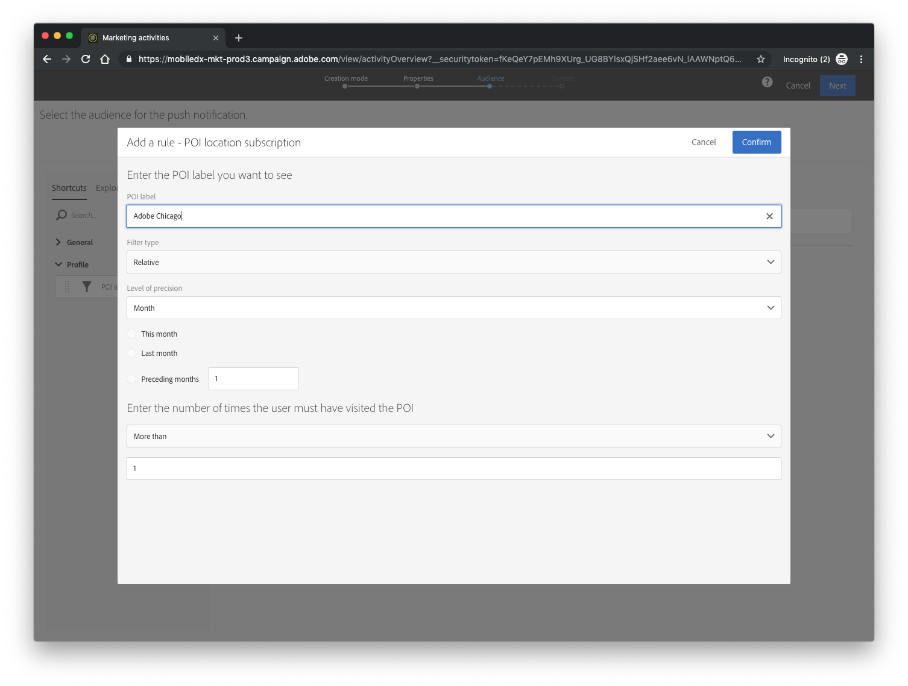
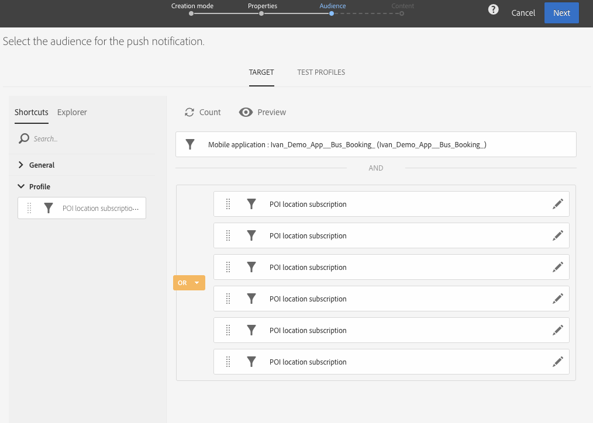

# Adobe Campaign Standard
## Push Notifications with Experience Platform Location Service

In this guide, we’ll show how you can use historical geo-location information to target push notifications delivered through Adobe Campaign Standard. 

Before we begin, this guide assumes that you have a mobile application already configured with the Adobe Experience Platform Mobile SDK, including the Adobe Campaign Standard extension. 

### Prerequisites

1. Integrate the [Adobe Experience Platform Mobile SDK](https://aep-sdks.gitbook.io/docs/getting-started/get-the-sdk) into your app.
2. Add the [Adobe Campaign Standard Extension](https://aep-sdks.gitbook.io/docs/using-mobile-extensions/adobe-campaign-standard) to your mobile app configuration.
3. [Create one or more POIs](https://placesdocs.com/places-services-by-adobe-documentation/places-database-management-1/managing-pois-in-the-places-ui#create-a-poi) in Adobe Experience Platform Location Services.
4. Enable and install the [Adobe Places extensions for Adobe Experience Platform Mobile SDKs]()


## Create data elements in Experience Platform Launch

After you verify that the Places and Places Monitor for Location Service extensions are working correctly in your application, create data elements in Experience Platform Launch. Data elements allow you to read the information that was provided by the extensions coming through the Mobile SDK event hub and act as an alias to retrieve data from the client application. Let’s create a few data elements to retrieve data from the Places extensions, so that we can send the Places information to Campaign.

1. In of your Experience Platform Launch mobile property, click the **Data Elements** tab and click **Add Data Element**.
2. In the **Extension** drop-down list, select **Places**.
3. From the **Data Element Type** drop-down list, select **Name**.
4. In the right-hand side pane, you can select **Current POI** which retrieves the name of the POI in which the user is currently located.

   **Last Entered** retrieves the name of the POI that user last entered, and **Last Exited** provides the name of the POI that the user last left. For this example, we will selected **Last Entered** and type a name for the data element, such as **Last Entered POI Name** and clicked **Save**.


5. Repeat the same steps above and create data elements for _Last Entered POI Latitude_, _Last Entered POI Longitude_, and _Last Entered POI Radius_.

In addition to the data elements for Location Service, ensure that you create Mobile Core data elements for _App ID_ and _Experience Cloud ID_.

## Create a rule to send location data to Adobe Campaign Standard

Rules in Experience Platform Launch allow you to create complex, multi-solution workflows based on event triggers. What’s great about rules, is that you can create new rules or modify existing ones and have the updates dynamically deployed to your mobile applications. In this example we’ll create a rule that will be triggered when a user enters a geo-fenced POI. After the rule is triggered, an update is sent to Campaign to record an entry to a specific POI for a particular user based on the Experience Cloud ID.

1. In your Launch mobile property click on the **Rules** tab and click **Add Rule**.
2. Under the **Events** section click **+** and select **Places** as the extension.
3. For the **Event Type** select **Enter POI**.
4. Name the rule, for example, **User entered POI**.
5. Click **Keep Changes**.
6. The **Conditions** section allows you to filter or place restrictions on when this rule should fire.  For now we will leave this blank.
7. Under the **Actions** section click **+** to create a new action
8. In the **Extension** drop-down list, select **Mobile Core,** and in the **Action Type** drop-down list, select **Send Postback**.
9. For the **URL**, you need to construct your Campaign Standard locations endpoint.  The URL should look similar to the one below. Ensure that you use the correct data elements that you created previously for your Campaign server and pKey. `https:///rest/head/mobileAppV5//locations/`
10. Click the box to add a post body and send the following:

    ```
    {
     "locationData": {
     "distances": "{%%Last Entered POI Radius%%}",
     "poiLabel": "{%%Last Entered POI Name%%}",
     "latitude": "{%%Last Entered POI Lat%%}",
     "longitude": "{%%Last Entered POI Long%%}",
     "appId": "{%%AppID%%}",
     "marketingCloudId": “{%%ecid%%}”
     }
    }
    ```

11. Ensure that you are using your specific data elements that you created in the previous section.
12. In **Content Type**, type **application/json**.
13. Click **Keep Changes** after you have this set up.
14. It can be helpful to have a Slack web hook setup as an additional action to validate that entries are being triggered and that the right data is being collected.


>Don’t forget to publish the recent changes to your app to make sure the rule and all of your data elements are deployed as part of your configuration. After publishing, you should launch the mobile application again to get the latest configuration updates.

## Use location data to target Campaign Messages

Now that we have location data populated in Campaign, we can use POIs as an audience segment tool.

1. In your Adobe Campaign Standard instance, click **Create Push Notification**.
2. For the push notification type, select  **Send push to Campaign profiles**.
3. Click **Next** and type the general details on the next screen.
4. On the Audience screen, click **Count** to see to how many estimated user the push notification will be sent.

*In this case, my count will equal three, as I have three devices that I have installed in which to test the application.*

5. On the left sidebar, expand the **Profile** tab and drag the **POI location** filter to the main area
6. In the POI filter window, enter the exact name of the POI that you want to target.

*You can make additional selections to determine the range of time since the user’s last visit to this POI.*



7. Click **Confirm**.
8. Run the count again at the top to see your audience size change.  If you do not see your count update, you might have entered a POI name for which no devices have triggered an entry. This is where having the Slack web hook becomes valuable, because you can see a listing of POI entries from various test devices.
9. You can drag out additional POI location filters to include multiple POIs in your message.
10. Click **Next** to finish creating the push notification for delivery.



Using Location Service with Adobe Campaign Standard gives you a powerful tool to segment and target your messaging to users based on geo-fence entries and extis. This simple integration opens the door for building out more personalized and contextual use cases.


