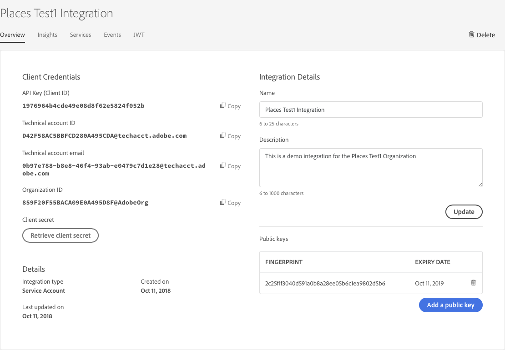

# Create a Places integration

## Generate a public and private key pair

To create a Places integration, you need a public and a private key pair. These pairs can be purchased, or you can generate your own self-signed keys.

To generate your own self-signed keys:

1. Copy and paste the following lines in a terminal window and press Enter after pasting each line:

   ```text
      mkdir keys
      cd keys
      openssl req -x509 -sha256 -nodes -days 365 -newkey rsa:2048 -keyout places_integration_test_private.key -out    places_integration_test_public.crt
   ```

   **Tip**: We recommend that you name your keys for easy reference and store them in a folder. If you create multiple integrations, you can easily identify and manage which keys belong to which integration.

2. Type the information that is requested by OpenSSL:

   ```text
   Country Name (2 letter code:  // Example: US
   State or Province Name (full name):  // Example: California
   Locality Name (eg, city):  // Example: San Jose
   Organization Name (eg, company):  // Example: Places
   Organizational Unit Name (eg, section):  // Example: Engineering
   Common Name (eg, fully qualified host name):  // Example: places.com
   Email Address:  // Example:  poi@places.com
   ```

   For more information about OpenSSL, see [OpenSSL](https://www.openssl.org/).

   **Important**: The information that you provide is incorporated into the keys.

3. Navigate to the directory where the `.key` and `.crt` files are located. For example, in iOS, go to **Macintosh HD** &gt; **users** &gt; \(**your user name**\) &gt; **Keys**.

The following video guides you through the process of generating the key pair:


## Create a Places integration in the Adobe I/O console

To create a Places integration:

1. Go to [https://console.adobe.io/](https://console.adobe.io/) and sign in with your Adobe ID.
2. If you have access to more than one Experience Cloud organization, select the organization from the drop-down list on the left.
3. Click **New Integration**.
4. Select **Access an API** and click **Continue**.
5. Under **Experience Cloud**, select **Places** as the Adobe service to which you want to integrate and click **Continue**.
6. Select **New integration** and click **Continue**.
7. On the _Create a new integration_ screen, enter a name and description. 
8. Drag and drop your `xxxx_public.crt` file, created above, to the **Public keys certificates** drop zone.
9. At the bottom of the page, click **Create integration**.
10. After a few seconds, you should see the _Integration created_ screen with the following message:

    `Your integration has been created.`

11. Click **Continue to integration details**. An overview of your integration with the API key, your organization ID, the technical account ID, and other details about your integrations are displayed.

## Record the organization ID and the API key

1. On the **Services** tab, confirm that **Places** is displayed.
2. On the **Overview** tab, locate and record the API Key \(Client ID\) and the Organization ID.

   These IDs will be needed for each Places Rest API request.



## Generate a JWT token

On the **JWT** tab, the Adobe I/O console allows you to test your integration by generating a JWT and providing you the exchange URL.

To generate a JWT token:

1. In a text editor, open your `private.key` file created above.
2. On the **JWT** tab, copy the contents of the key, and paste it in the **Paste private key** field. 
3. Click **Generate JWT**.
4. In the **Sample CURL command** section, click **Copy** and paste the contents in your command prompt or terminal window.
5. Run the command \(press Enter on your keyboard\).
6. Locate the `"token_type": "bearer"` and the `"access_token"` value.  The value of the bearer access token is what you will use in your Places API requests.  

**Important**: Adobe access tokens are valid for 24 hrs. Save the sample CURL command \(step 5\) because, if the access token is no longer valid, you will need to regenerate the token.

